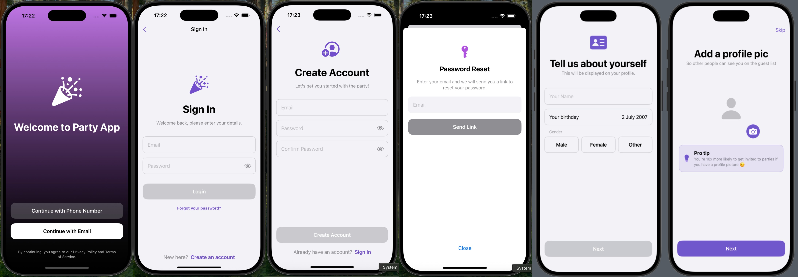
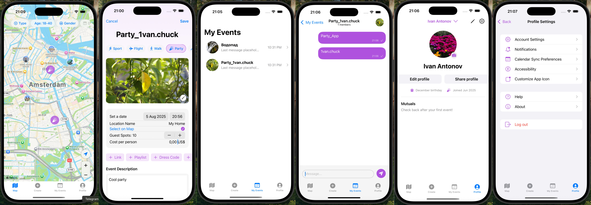
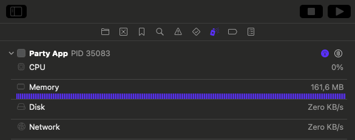

Party App - SwiftUI Social Event Platform (Demo)
This repository contains a public demonstration of Party App, a modern, full-featured social event application built with SwiftUI. This project serves as a portfolio piece to showcase my skills in end-to-end iOS development, from robust architecture and UI/UX to seamless backend integration.

About This Demo
Please note that this is a public-facing repository. To protect proprietary business logic and for security, several key files have been intentionally excluded via .gitignore. This repository's primary purpose is to showcase my coding style, project structure, and my approach to building high-quality UI components.

Key omitted files include:

GoogleService-Info.plist (Firebase configuration keys)

Core manager classes (UserManager, StorageManager, etc.) responsible for direct API and database interactions.

Specific ViewModels and data models containing sensitive business logic.

The code provided is sufficient to demonstrate my expertise in building a clean, scalable, and modern iOS application.

📸 Screenshots
Authentication Flow

Main App Features

Stability & Performance

✨ Key Features & Technical Highlights
This application demonstrates a wide range of modern iOS development practices and features.

Key Features:
Secure Authentication Flow: Complete, multi-step user registration and login system using Firebase Authentication.

Interactive Live Map: A real-time map, powered by MapKit, allowing users to discover and browse events based on their location.

Real-Time Chat: Every event features a dedicated chat room with real-time messaging, built using Firestore Snapshot Listeners and Swift's modern concurrency features.

Full Event Management: A complete CRUD (Create, Read, Update, Delete) system for events, including image uploads via PhotosUI and storage management with Firebase Storage.

Modular & Reusable UI: A component-based UI approach ensures a consistent look and feel and a highly maintainable codebase.

Architecture & Technology:
100% SwiftUI: The entire user interface is built using Apple's modern, declarative framework, showcasing advanced state management and view composition.

MVVM Architecture: The project follows a strict Model-View-ViewModel pattern, ensuring a clean separation of concerns and a highly testable code structure.

Swift Concurrency: All asynchronous operations, including network requests, are handled efficiently and safely using async/await.

Firebase Backend: Leverages the full power of the Firebase suite for the database (Firestore), user management (Authentication), and file storage (Storage).

Dependency Injection: Effectively uses @StateObject and @EnvironmentObject to manage state and dependencies throughout the application lifecycle.

Building the Project
As noted above, key manager and configuration files are omitted from this public repository. Therefore, the project will not build directly. This code is provided for review purposes to demonstrate my technical skills and architectural approach.

I am happy to discuss the implementation details of the omitted files in an interview setting.
